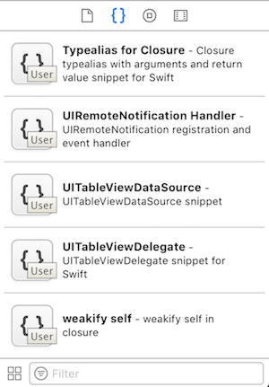
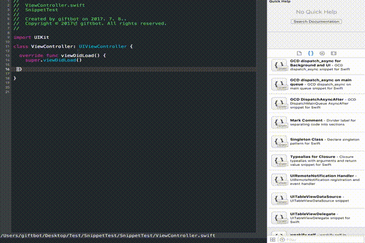

# Xcode Swift Snippets

Xcode Swift 3 snippets to make your life easier.

## How to install

1. Clone or download
2. Move snippet files into `~/Library/Developer/Xcode/UserData/CodeSnippets/` directory. (Create it if it doesn't exist)
3. Quit & Restart Xcode
4. You can find snippets from Utilities (image shown below)

※ Note: Xcode sometimes doesn't recognize immediately cause by Xcode bug. Then follow the guide below.

1. Go to Xcode > Preferences > Text Editing
2. Under Code completion - Uncheck 'Suggest completions while typing'
3. Quit out of Xcode and then relaunch Xcode.
4. Checke 'Suggest completions while typing' again.
5. Quit out of Xcode and then relaunch Xcode.
6. Enjoy it!

## Usage

All snippets I created have prefix `s_` abbreviation for Snippet.  `ex) s_Singleton`
Thus, start type with `s_` in Xcode for all the snippets.

## Uninstall

Reverse install. Easy.

## Contributing

Issues, PRs and adding your custom snippets are always welcome.

## License

**Xcode Swift Snippets** is under the MIT license. See LICENSE for details.
